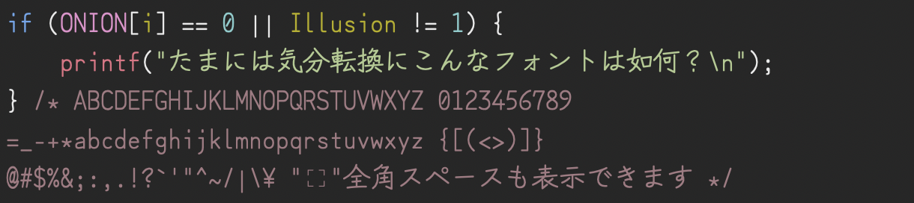
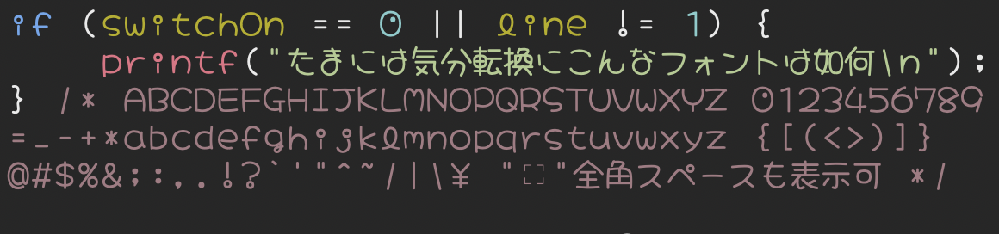
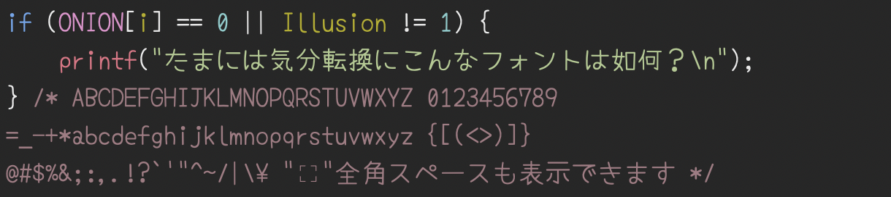
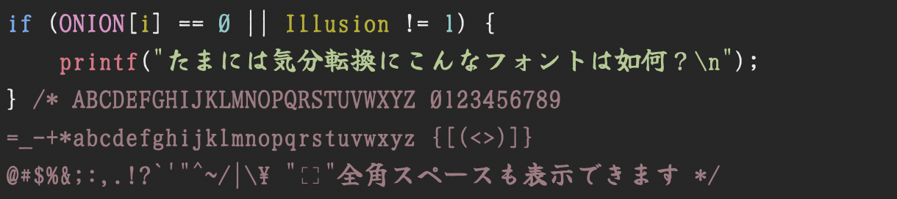
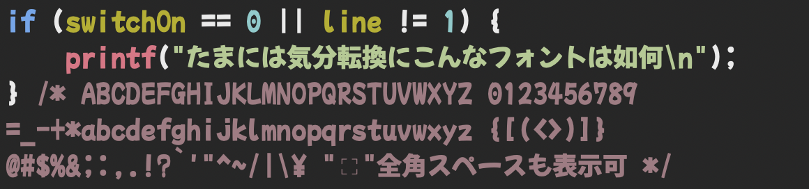
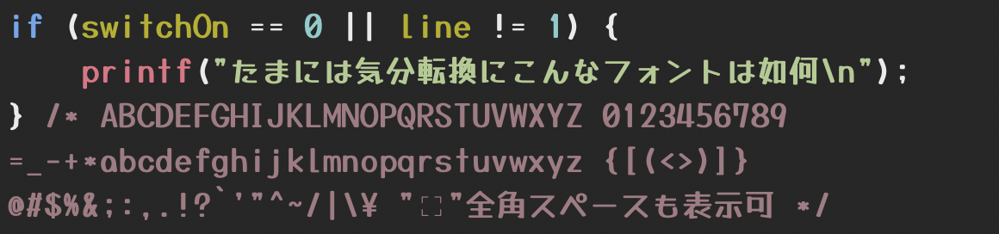

# 日本語フォント開発用途化計画

プログラミングフォントってもっと自由でもいいんじゃなかろうかというコンセプトの元、Google Fonts から9つの日本語フォントを選定して等幅化、一部の文字について識別性向上のグリフ加工をしました。

## 各フォントの共通事項

- 生成スクリプトにより機械的に半角文字と全角文字に振り分け、サイズやウェイトを調整しました。
- OpenTypeの "ss01" または "cv01" フィーチャータグを有効にすると全角スペースを可視化できます。

## フォント個別の改変内容とサンプル

### Benishijimi (紅しじみ)

- 素材フォント: [Zen Kurenaido (ZEN 紅道)](https://github.com/googlefonts/zen-kurenaido)
- 半角:全角比率 1:2
- ` のグリフクラスを「マーク」から「クラスなし」に変更しています。
- 手動で調整、改変したグリフ: 0 I * + \ ~ | ´ (半角)、０ Ｉ (全角)
- 追加したグリフ: － ～ (全角)、可視化した全角スペース

### CueYen Pop (キューえんポップ)

- 素材フォント: [Hachi Maru Pop (はちまるポップ)](https://github.com/noriokanisawa/HachiMaruPop)
- 半角:全角比率 3:4
- 手動で調整、改変したグリフ: 0 " ' , . ; : | (半角)、０ ， ． ； ： 敲 寂 (全角)
- 追加したグリフ: 㪣 (全角)、可視化した全角スペース

### Gyaragga (ギャラガ)

- 素材フォント: [Reggae One (レゲエ One)](https://github.com/fontworks-fonts/Reggae/)
- 半角:全角比率 3:5
- OpenTypeの "liga" フィーチャーを削除しています。
- 手動で調整、改変したグリフ: 0 I l * , . ; : { } | (半角)、０ Ｉ ｌ ， ． ； ： ｛ ｝ (全角)
- 追加したグリフ: 可視化した全角スペース

### Kyuri Maru (キュウリ丸)

- 素材フォント: [Kiwi Maru (キウイ丸)](https://github.com/Kiwi-KawagotoKajiru/Kiwi-Maru)
- 半角:全角比率 1:2
- OpenTypeの "liga" フィーチャーを削除しています。
- 手動で調整、改変したグリフ: 0 罫線 (半角)、０ (全角)
- 追加したグリフ: 可視化した全角スペース

### Mogusa (もぐさ)

- 素材フォント: [Yomogi (よもぎフォント)](https://github.com/satsuyako/YomogiFont)
- 半角:全角比率 1:2
- OpenTypeの "liga" フィーチャーを削除しています。
- 手動で調整、改変したグリフ: 0 a j l * = (半角)、０ ｌ (全角)
- 追加したグリフ: 可視化した全角スペース

### Potori (ポトリ)

- 素材フォント: [Potta One (ポッタ)](https://github.com/go108go/Potta)
- 半角:全角比率 3:5
- OpenTypeの "liga" フィーチャーを削除しています。
- 手動で調整、改変したグリフ: 0 I j l * ` ´ (半角)、０ Ｉ ｊ ｌ ｀ (全角)
- 追加したグリフ: ＂ ＇ (全角)、可視化した全角スペース

### SyukuZen (肅然)

- 素材フォント: [Yuji Syuku (佑字 肅)](https://github.com/Kinutafontfactory/Yuji)
- 半角:全角比率 1:2
- OpenTypeの "liga" フィーチャーを削除しています。
- 手動で調整、改変したグリフ: 0 1 l # * (半角)、０ １ ｌ (全角)
- 追加したグリフ: 可視化した全角スペース

### Tochinoki Pop (とちのきポップ)

- 素材フォント: [Mochiy Pop One (モッチーポップ)](https://github.com/fontdasu/Mochiypop)
- 半角:全角比率 3:5
- 手動で調整、改変したグリフ: 0 I * - , . ; : @ ` ´ (半角)、０ Ｉ ， ． ； ： (全角)
- 追加したグリフ: ＂ ＃ ＄ ＇ ＊ － ＜ ＞ ＾ ＿ ｀ ｜ (全角)、可視化した全角スペース

### Yusei Marker (油性マーカー)

- 素材フォント: [Yusei Magic (油性マジック)](https://github.com/tanukifont/YuseiMagic)
- 半角:全角比率 3:5
- 手動で調整、改変したグリフ: 0 l * - , . ; : " ' @ ` { } | ´ (半角)、０ ｌ ， ． ； ： ＂ ＇ ｀ ｛ ｝ (全角)
- 追加したグリフ: 可視化した全角スペース

## ライセンス

- 各フォントのライセンスは [SIL Open Font License Version 1.1](https://github.com/omonomo/JPMonoFonts/blob/main/OFL.txt) です。
- 素材フォントのライセンスにつきましては別途確認をお願いいたします。
- 生成スクリプトのライセンスは [MIT License](https://github.com/omonomo/JPMonoFonts/blob/main/LICENSE.txt) です。
- 生成スクリプトの一部に [ricty_generator-4.1.1.sh](https://rictyfonts.github.io) を使用しています。

## メモ

- 自作合成フォント[Cyroit](https://omonomo.github.io/Cyroit/)シリーズはいろいろとこだわりすぎたためフォントも生成スクリプトを肥大化してしまいました。今回は肩の力を抜いて必要最低限と思われる改変のみを行っています。
- 自動生成で文字幅の統一化をしているため、縦線の太さのばらつきなど少し気になるところがあります。あまりモニタに近づいて見ないようお願いいたします。
